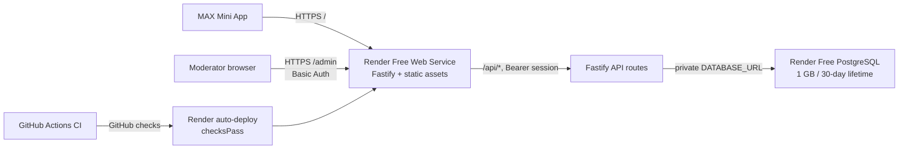

# MaxTown on Render Free

**Status:** Conversational design approved; awaiting review of this written specification.

## Context and decision

The MaxTown application release was merged to `main` as `bc2f362`. Its GitHub CI passed and published the four OCI images to GHCR. The former VPS deploy job stopped because no VPS SSH values were configured. The project owner confirmed that there is no VPS and selected Render Free.

Deploy one Fastify web service and one Render Free PostgreSQL database from a Render Blueprint. The web service serves the Mini App, serves the Moderator panel, handles the existing API, and enforces Moderator Basic Authentication itself. GitHub Actions remains responsible for verification. Render connects to the GitHub repository and deploys `main` only after checks pass.

This is a demo setup. Render Free web services can sleep after 15 minutes without inbound traffic and take about a minute to wake. Free PostgreSQL is limited to 1 GB, expires 30 days after creation, has a 14-day upgrade grace period, and is deleted afterward. The workspace also has 750 free web-service hours per calendar month. See [Render Free limitations](https://render.com/docs/free). The owner chose this mode with these limits disclosed.

## Goals

- Operate MaxTown without managing a VPS, SSH access, or a container registry release pipeline.
- Keep CI on GitHub and make Render wait for successful GitHub checks before deploying.
- Keep API access, Moderator credentials, and household membership checks server-side.
- Exercise the same single-service application and database topology in the local Compose smoke test.
- Make the setup reproducible from files in the repository and list the few steps that require the owner's Render and MAX accounts.

## Non-goals

- Persistent production data, backups or point-in-time recovery guarantees, a production availability target, or always-warm response times.
- A custom domain, a MAX Bot deployment, or a separate private API service on the Free plan.
- Removing local `npm run dev:*` workflows.

## Architecture

One Node process is used deliberately. Render Free web services cannot receive private-network traffic, so separating the gateway and API would either make the API publicly reachable or require a paid private service. A single web service keeps the Moderator authentication boundary in the same server that handles Moderator data and avoids service-to-service secrets.

### HTTP paths and static assets

- `/` and non-API Mini App routes serve the Mini App Vite build.
- `/admin/` and its assets serve the Admin Vite build, built with base path `/admin/`.
- `/api/*` remains handled by the existing Fastify routes.
- `/api/health` and `/api/ready` remain available for platform health checks.
- Fastify registers API routes before explicit SPA fallbacks. Static file lookup denies dotfiles and does not treat missing `/api/*` routes as SPA navigation.
- Both frontends continue to call same-origin `/api` URLs; CORS is not introduced.

The API Dockerfile becomes a multi-stage image: install locked workspace dependencies, build both frontends, then assemble only runtime files, frontend distributions, and required production dependencies. The server listens on Render's `PORT` value and `0.0.0.0`; local development remains available through the existing workspace commands.

### Moderator authentication

Today Caddy protects `/admin` and `/api/moderator/*`, removes the caller-supplied `X-MaxTown-Moderator` header, and forwards the authenticated principal. The single-service deployment moves that boundary into Fastify:

1. A shared Fastify hook protects `/admin`, `/admin/*`, and `/api/moderator/*` with HTTP Basic Authentication over Render's HTTPS endpoint.
2. The server reads `MODERATOR_USERNAME` and a bcrypt-compatible `MODERATOR_PASSWORD_HASH` from environment variables. The plaintext password is never stored in the database or repository.
3. Basic credentials are parsed and checked server-side. Malformed and invalid credentials receive `401` and `WWW-Authenticate`; supplied identity headers are discarded before authorization.
4. The authenticated principal is checked against the existing enabled `moderators` table before registration data can be read or changed.
5. On startup, when configured, the app inserts the initial Moderator principal only if absent. It never re-enables a disabled principal.

`BOT_TOKEN` remains a Render secret and MAX `initData` continues to be validated only by the API. Resident sessions remain random bearer tokens stored as hashes. House membership and per-house role checks are unchanged.

### Database startup

The Blueprint creates a Free PostgreSQL database in the same Render region as the web service and passes its internal connection string as `DATABASE_URL`. The web process applies the existing SQL migrations through `runMigrations` before listening. Migrations are idempotent and serialized with the existing PostgreSQL advisory lock. A failed database connection or migration prevents the service from reporting ready. The API readiness route continues to run a database query.

Render Free does not support pre-deploy commands. Running the existing migration runner during process startup is safe for the selected single-instance demo topology and avoids a paid job. A future production upgrade should move migrations to a paid pre-deploy step before enabling concurrent instances.

## CI and deployment

- Keep the GitHub CI workflow for install, typecheck, tests, builds, database migration checks, and Docker smoke coverage.
- Add a CI check that parses `render.yaml` and builds the exact single-service image referenced by the Blueprint.
- Remove the VPS `workflow_run` deployment workflow and GHCR release publishing job. They are no longer the deployment path.
- Add a Render Blueprint defining one `free` Docker web service, a `free` Postgres database, health path `/api/ready`, and `autoDeployTrigger: checksPass` on `main`.
- Render builds from the Git repository and activates the deploy after GitHub checks succeed. Its web health check verifies that the Fastify process started and the database is reachable.
- Keep local Compose as a clean-stack smoke path for API, built Mini App, built Admin panel, Basic Auth, migration, and readiness checks. No production secrets are committed.

Render Blueprints support a `checksPass` trigger, and the deploy flow waits for GitHub CI conclusions before deployment. The Render service must be created once by connecting the GitHub repository and applying the Blueprint in Render Dashboard. `BOT_TOKEN` and `MODERATOR_PASSWORD_HASH` are prompted/entered as secret values there; the Blueprint stores no secret value.

## Failure behavior and recovery

- Invalid configuration, missing secrets, database unavailability, migration failure, or failed health checks must produce an unhealthy/failed deploy rather than a false success.
- No app data is written to the web service filesystem; it is ephemeral and may be discarded on restart or sleep.
- Render Free has no production backup guarantee. The demo owner must export needed data before the database expiration date or upgrade the database during the 14-day grace period. Do not claim the free database is a durable release target.
- Free service hours, build minutes, and outbound bandwidth are limited. If a payment method is attached, usage beyond included limits can incur charges; without one, Render can disable services when limits are exhausted. Keep deployment to one Free web service and monitor usage.
- If a deploy fails, use Render's rollback to a prior deploy where available. A rollback does not restore data deleted from an expired database.

## Verification and acceptance

### CI

1. `npm ci`, `npm run typecheck`, `npm test`, and `npm run build` pass.
2. The Render web image builds with both Vite distributions and starts using `PORT`; the optional bot image continues to build in CI.
3. `render.yaml` parses and declares only the expected web service and PostgreSQL database, both on the Free plan, with CI-gated deployment.
4. Database migrations pass from an empty database and on replay.
5. Compose smoke passes on a clean disposable database and removes only its own resources.

### HTTP and authorization smoke

- `/` serves the Mini App HTML and a built asset.
- `/admin/` returns `401` until Basic Auth succeeds, then serves the Admin HTML.
- `/api/moderator/registrations` returns `401` without credentials, rejects invalid credentials, and returns data only for the enabled DB principal after valid credentials.
- Spoofed `X-MaxTown-Moderator` does not grant access.
- `/api/health` and `/api/ready` pass; `/api/auth/max` rejects invalid `initData`.
- A normal authenticated resident can still use same-origin app APIs but cannot access Moderator APIs.

### Hosted verification

After the owner applies the Blueprint and enters MAX and Moderator secrets, wait for Render's GitHub-check-gated deployment to become healthy. Run the public smoke check against the returned `onrender.com` URL, verify the website, health/readiness, invalid MAX authentication rejection, and Moderator authentication. Do not report hosted verification before these requests pass.

## Open setup steps owned by the account holder

1. Sign in to Render and connect the GitHub repository `XANXED/MaxTown`.
2. Apply the repository Blueprint on `main` and choose the Free plans in the creation flow.
3. Enter `BOT_TOKEN` and `MODERATOR_PASSWORD_HASH` in the service's secret variables. Keep the username/principal consistent with `MODERATOR_USERNAME`.
4. Copy the deployed HTTPS URL to the MAX Mini App configuration.
5. Open the app once deployed and execute the documented hosted smoke check.

The assistant can prepare and review the Blueprint and code in GitHub, but cannot create resources in an account that is not connected to this task.

## References

- [Render Blueprint specification](https://render.com/docs/blueprint-spec)
- [Render deployment and GitHub CI integration](https://render.com/docs/deploys)
- [Render Free service and database limitations](https://render.com/docs/free)
- [Render private network behavior](https://render.com/docs/private-network)
- [Fastify static-file patterns](https://github.com/fastify/fastify-static/blob/main/_autodocs/usage-patterns.md)

## Alternatives considered

- **Render paid service and database:** private API, warm service, and durable managed database; rejected for this iteration because the owner selected Free.
- **Railway usage-based plan:** viable for a no-VPS app, but introduces a second provider-specific provisioning and pricing choice without improving this project's chosen GitHub CI-gated workflow enough to justify switching.
- **Keep the VPS deployment:** not actionable because no VPS exists, and it leaves the production workflow failing on absent SSH values.
